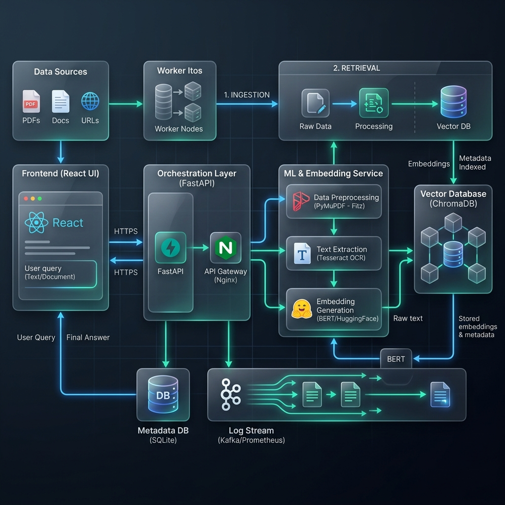
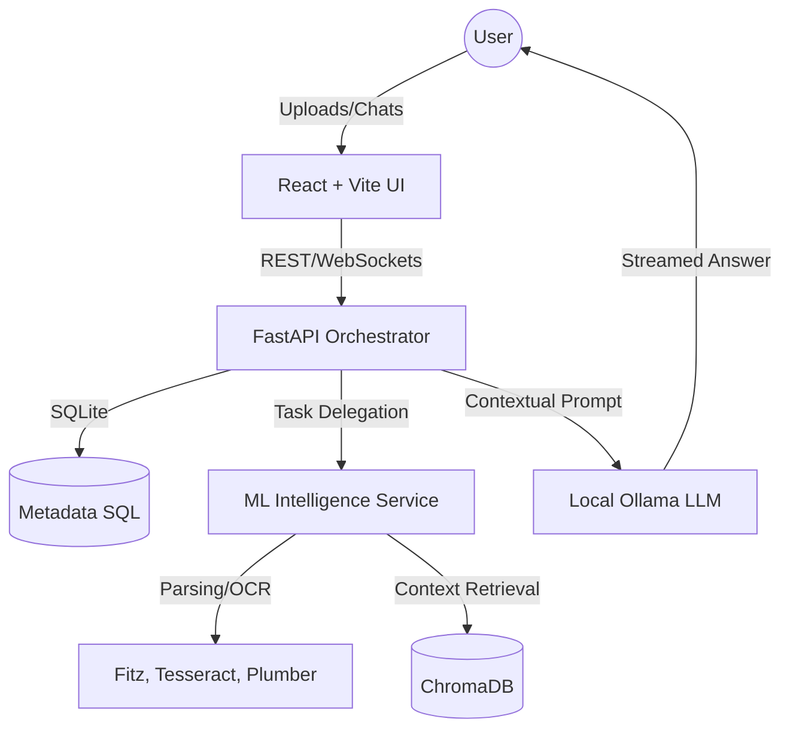

# 🚀 CustomDoc: Professional Local RAG Intelligence


**CustomDoc** is a high-fidelity, local-first document intelligence platform. It allows you to chat with your documents (PDF, Docx, Images) using state-of-the-art Retrieval-Augmented Generation (RAG) while ensuring 100% data privacy.

---

## 🏗️ System Architecture





---

## ✨ Key Features

### 🔍 Intelligence & Extraction
- **Advanced 5-Step Wizard**: Complete control over your document extraction strategy.
- **Hybrid Parsing**: Switch between `fitz` (high-speed) and `pdfplumber` (high-accuracy).
- **OCR-on-Demand**: Integrated Tesseract 5.0 for images and scanned documents.
- **Multi-Strategy Chunking**: Recursive and Semantic segmentation to preserve context.

### 🧠 RAG Dynamics
- **Local-First Privacy**: Your data never leaves your machine. No OpenAI/Anthropic APIs required.
- **Session Isolation**: Each project is its own private sandbox with dedicated vector collections.
- **Hybrid Retrieval**: Specialized BM25 + Vector similarity search (via ChromaDB).

### ⚡ Performance & Feedback
- **Hardware Acceleration**: Automatic NVIDIA/CUDA detection and utilization for embeddings.
- **Live Pipeline Stream**: Real-time progress updates via WebSockets during document processing.
- **Glassmorphism UI**: A premium, motion-rich interface built with Framer Motion and custom CSS tokens.

---

## 🛠️ Tech Stack & Pillars

| Layer | Technologies |
|---|---|
| **Frontend** | React 18, Vite, Framer Motion, Lucide Icons, Axios |
| **Backend** | FastAPI, SQLAlchemy, SQLite, Pydantic, WebSockets |
| **Intelligence** | PyTorch, SentenceTransformers, ChromaDB, HuggingFace |
| **Parsing** | PyMuPDF (fitz), pdfplumber, Tesseract OCR, python-docx |
| **Inference** | Ollama (Local LLM Orchestration) |
| **Infrastructure** | Docker, Docker Compose, NVIDIA Container Toolkit |

---

## 🚀 Quick Start

### 1. Prerequisites
- **Docker & Docker Compose** installed.
- **NVIDIA Container Toolkit** (Optional, for GPU acceleration).
- **Ollama** installed and running on the host machine.

### 2. Launch the Environment
```bash
# Clone the repository
git clone https://github.com/amit-dhakad/customDoc-vectorSearch.git
cd customDoc-vectorSearch

# Start the services
docker-compose up --build
```

### 3. Access the Platform
- **Frontend**: http://localhost:5173
- **API Documentation**: http://localhost:8000/docs
- **ML Intelligence API**: http://localhost:8001/docs

---

## 🔬 Technical Documentation
For a deep dive into the RAG orchestrator, segmenting strategies, and hardware passthrough logic, see our internal manual:
👉 [TECHNICAL_ARCHITECTURE.md](./TECHNICAL_ARCHITECTURE.md)

---

## 🎓 Interview Masterclass
Built into the platform is a specialized **RAG Engineering Masterclass**. It contains 100+ Senior and Architect level deep-dive questions and answers regarding document intelligence, vector databases, and production LLM scaling.
