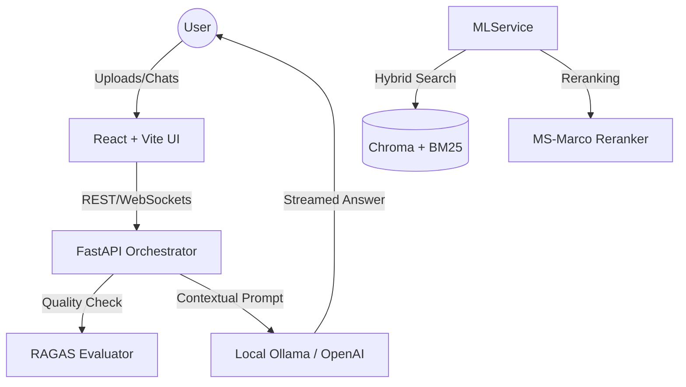

# 🚀 CustomDoc: Tier 1 RAG Intelligence Platform


**CustomDoc** is a professional-grade, local-first RAG (Retrieval-Augmented Generation) system designed for senior-level engineering demonstrations. It moves beyond simple Top-K retrieval by implementing a **Scientifically Evaluated Pipeline** with Hybrid Search, Cross-Encoder Reranking, and real-time observability.

---

## 🏗️ Technical Excellence (Tier 1 Features)

### 📊 1. Measurable Evaluation (RAGAS)
The biggest gap in "junior" RAG projects is lack of measurement. CustomDoc integrates the **RAGAS** framework to score every interaction across four critical dimensions:
- **Faithfulness**: Is the answer factually grounded in the source?
- **Answer Relevancy**: Does the response directly address the user query?
- **Context Precision**: How well-ranked are the retrieved chunks?
- **Context Recall**: Did the retrieval system find all necessary information?

### 🔍 2. Advanced Retrieval Architecture
We implement a multi-stage retrieval pipeline used by industry leaders:
- **Hybrid Search**: Combines **BM25 (Keyword)** with **Dense Vector (Semantic)** search using **Reciprocal Rank Fusion (RRF)**.
- **Cross-Encoder Rerank**: After initial retrieval, we use a `ms-marco-MiniLM-L-6-v2` cross-encoder to re-score and re-rank the top candidates, significantly reducing "hallucinations" by ensuring the most relevant context is top-of-mind for the LLM.

### 📈 3. Observability Dashboard
A dedicated **Performance Analytics** tab visualizes system telemetry and quality scores.
- **Latency Breakdown**: Track Retrieval vs. Generation time in milliseconds.
- **Quality Distributions**: View average RAGAS scores across all sessions.
- **Trend Analysis**: Sparkline-driven visualization of quality scores over time.
- **Real-time Logs**: WebSocket-driven progress streaming for all ingestion tasks.

### 🎛️ 5. Interactive Retrieval Tuning
Total control over the RAG pipeline is available directly in the chat interface:
- **Toggle Hybrid Search**: Switch between semantic (Dense) and keyword (BM25) modes in real-time.
- **Enable Reranking**: Activate the Cross-Encoder verification layer with a single click to see the impact on answer precision.

### ⚙️ 4. Operational MLOps (CI/CD)
- **Automated Testing**: Pytest suite for core ML and API logic.
- **Static Analysis**: Ruff-based linting for code quality.
- **Frontend Verification**: Automated build checks to ensure UI integrity.
- **Container Health**: GitHub Actions verify Docker builds and dependency integrity on every push.

### 🔬 6. Retrieval Verification Suite
A specialized benchmarking tool (`verify_retrieval.py`) is included to scientifically compare retrieval strategies.
- **Side-by-Side Comparison**: Run queries against Dense, Hybrid, and Reranked indices.
- **Latency Benchmarking**: Measure the exact overhead of the Cross-Encoder layer.

---

## 🏗️ System Architecture




---

## 🚀 Quick Start

### 1. Prerequisites
- **Docker & Docker Compose**
- **Ollama** running on host (for local inference).
- **OpenAI API Key** (Optional - for high-speed RAGAS evaluation).

### 2. Launch
```bash
docker-compose up --build
```

### 3. Access
- **Main App**: http://localhost:5173
- **Analytics**: http://localhost:5173/metrics
- **API Docs**: http://localhost:8000/docs

---

## 🔬 Deep Dive
For a deep dive into the RAG orchestrator and hardware passthrough logic, see our internal manual:
👉 [TECHNICAL_ARCHITECTURE.md](./TECHNICAL_ARCHITECTURE.md)
👉 [SYSTEM_DESIGN_PATTERNS.md](./SYSTEM_DESIGN_PATTERNS.md)

## 🎓 Interview Masterclass
Built into the platform and available for study is a specialized **RAG Engineering Masterclass**. It contains 100+ Senior and Architect level deep-dive questions focusing on vector databases, hybrid retrieval, and production scaling.

👉 **[Launch INTERVIEW_MASTERCLASS.md](./INTERVIEW_MASTERCLASS.md)**

## 🛠️ Infrastructure Mastery
CustomDoc is production-ready with enterprise-grade operational standards:
- **Production Stack**: `docker-compose -f docker-compose.prod.yml up`
- **Healthcheck Orchestration**: Zero-downtime initialization using `depends_on` conditions; Backend waits for ChromaDB and ML-Service heartbeats.
- **Structured Observability**: Unified logging (`Timestamp | Level | Component | Message`) across all services.
- **Global Error Handling**: Fail-safe API design that prevents stack-trace leaking while maintaining unique Error IDs for debugging.
